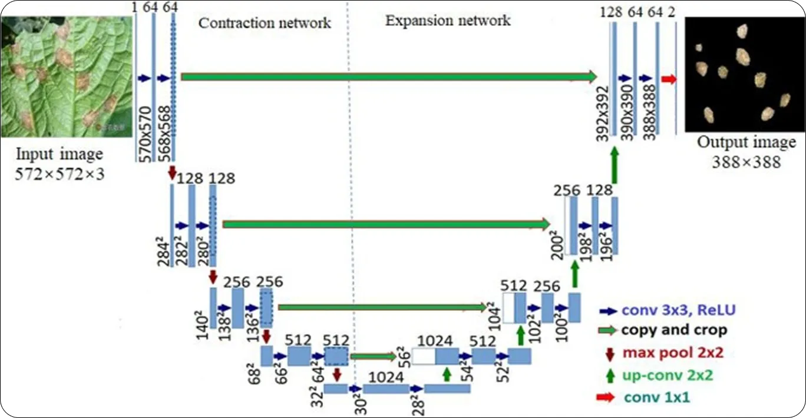

# U-Net Model

## U-Net Architecture

The U-Net model is a specialized extension of the standard encoder-decoder architecture, designed for efficient image segmentation, particularly in medical imaging and other pixel-level tasks. It builds on the encoder-decoder concept by adding skip connections to preserve fine-grained spatial information. Key components include:

**Encoder:**  
- Extracts high-level semantic features from the input image.  
- Typically consists of convolutional layers followed by max-pooling operations that progressively reduce spatial dimensions while increasing feature depth.  
- Captures abstract information such as shapes, textures, and structural patterns.

**Bottleneck:**  
- The deepest part of the U-Net where spatial dimensions are smallest.  
- Captures the most abstract features of the image, containing the encoded information for the segmentation task.  

**Decoder:**  
- Restores the spatial resolution of the feature maps to match the original image size.  
- Uses upsampling or transposed convolutional layers to expand the feature maps, converting the encoded features back into a segmentation mask.  
- Integrates information from the encoder via skip connections to improve reconstruction and accuracy.

**Skip Connections:**  
- Directly link corresponding layers in the encoder and decoder.  
- Preserve fine-grained details that may be lost during downsampling, allowing the decoder to produce precise segmentations, especially for boundaries and small structures.  

By combining the standard encoder-decoder approach with skip connections, U-Net balances abstract feature extraction and fine-grained spatial detail recovery, making it highly effective for segmentation tasks where both context and detail are important.
