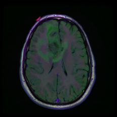
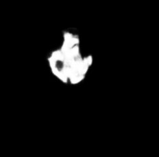
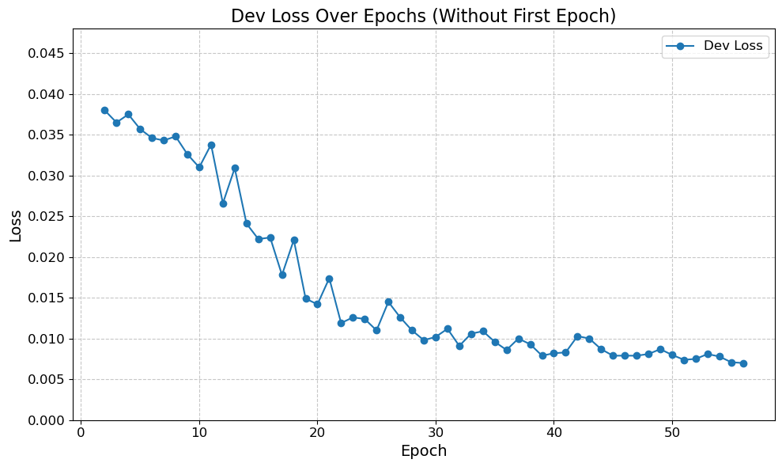
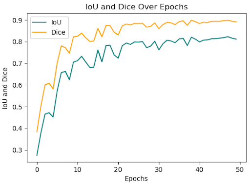

## Biomedical Image Models

These models are convolutional neural networks trained on my local GPU, designed to analyze MRI brain scans and outline possible tumors or abnormalities. This project has undergone multiple iterations, training cycles, and tuning adjustments to develop several models, which are showcased in this folder.

The models were trained in a virtual environment using Conda and WSL to run a Jupyter Notebook in VS Code, leveraging a local GPU. They were implemented in PyTorch, a Python library, to train and optimize various architectures for segmenting abnormalities and tumors from MRI brain scans.

### Example:
| Image | Model Prediction | True Mask |
|--------|-----------------|-----------|
|  |  |   |

These images visualize how one of my U-NET models processes an MRI scan, producing a predicted segmentation compared to the actual mask.

### Training Progress:
| Development Loss | DICE & IoU Metrics |
|-----------------|-------------------|
|  |  |

- **Dev Loss:** Tracks how the model improves during training; lower values indicate better performance.  
- **DICE & IoU Metrics:** Measure segmentation accuracy per epoch, with higher values representing better model predictions.

