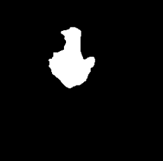

# 🧠 Biomedical MRI Image Segmentation Models

---

## 🧭 Overview

 Collaborative project with **Cedars-Sinai Medical Center** exploring **AI for diagnostic imaging**.

This project applies **deep learning for medical image segmentation** to assist in the early and accurate detection of brain tumors.  
Using **convolutional neural networks (CNNs)** built in **PyTorch**, these models analyze MRI brain scans and highlight regions that may represent abnormalities or tumors.  

The goal is to **enhance diagnostic accuracy**, enabling faster treatment decisions and reducing diagnostic errors through **AI-assisted imaging**.

---

## 🚀 Features / Highlights

- 🧩 **U-Net** and **Encoder–Decoder** architectures implemented for biomedical image segmentation.  
- 📈 Achieved up to **90.9% Dice Coefficient** and **83.3% IoU**, representing a **5.6% improvement** over the baseline benchmark.  
- ⚙️ Trained locally on GPU using a **Conda virtual environment** and **WSL** integration with **VS Code**.  
- 📊 Visualization of **training progress**, **loss metrics**, and **model predictions** vs. ground-truth masks.  
- 🧠 Demonstrates strong understanding of **model training, tuning, and evaluation** in a healthcare-relevant context.

---

## 🧰 Technologies Used

| Category | Tools & Frameworks |
|-----------|--------------------|
| **Programming Language** | 🐍 Python |
| **Machine Learning Framework** | 🔥 PyTorch |
| **Development Environment** | 💻 Conda • WSL • VS Code |
| **Data Sources** | 🧬 Kaggle MRI Brain Scan Datasets |
| **Visualization / Preprocessing** | 📉 Matplotlib • NumPy • Pandas |
| **Notebooks** | 📓 Jupyter Notebooks |

---

## 🧪 Demo
### 🩺 Sample Prediction
| Original Image | Model Prediction | True Mask |
|--------|------------------|------------|
|  |  |  |

These examples illustrate how the U-Net model segments MRI scans, highlighting tumor boundaries compared to ground-truths.

In the dataset, the true (human-defined) masks are fully filled regions representing the tumor area — a simplified binary segmentation where all pixels inside the boundary are labeled as tumor.

In contrast, the model’s predictions may show partial filling or small gaps within the same region. This reflects the model’s uncertainty in areas of varying MRI intensity, even when it correctly identifies the overall tumor shape.

This does not necessarily mean the model is inaccurate. A “perfect” prediction would visually match the intentionally filled ground-truth mask, but in reality, such uniform filling rarely mirrors the true biological texture of a tumor — it simply reflects how the dataset defines “tumor” for evaluation.

The primary goal of these masks is to determine whether a tumor is present, and if so, where it is located and what its boundaries are — objectives that the model successfully achieves here.

<h3>📉 Training Progress</h3>

<p align="left">
  <br>
  <strong>Development Loss:</strong> Monitors optimization progress — lower values indicate better convergence.
</p>

<p align="left">
  <br>
  <strong>Dice & IoU Metrics:</strong> Quantify segmentation accuracy per epoch — higher values reflect more accurate masks.
</p>
> ⚠️ **Note:** An NVIDIA CUDA-enabled GPU is recommended for efficient training.

<h4>📊 Interpretation Notes</h4>

- An **epoch** is a single pass through the entire training dataset during model training. Multiple epochs allow the model to learn patterns more effectively. 
- Minor gaps or underfilled regions in predictions can reduce Dice/IoU values, even if the tumor’s shape and boundaries are correctly identified.  
- A high Dice/IoU score indicates strong overlap with the human-defined masks, demonstrating the model accurately segments the target regions.  
- Remember: The true masks are fully filled for evaluation purposes; actual tumor textures may vary in biological data.

## ⚙️ Setup Instructions
### 1️⃣ Clone the Repository
   ```bash
   git clone https://github.com/MikHuz/AI-Models.git
   cd AI-Models
   ```
2️⃣ Create and Activate the Conda Environment
   ```bash
   conda create -n ai-models python=3.9
   conda activate ai-models
   ```
3️⃣ Install Dependencies
   ```bash
   pip install
   ```
5️⃣ Run the Training Notebook
   ```bash
   jupyter notebook
   ```
5️⃣ Run the Training Notebook
   - Select a model (U-Net or Encoder-Decoder).
   - Load MRI dataset paths in the configuration cell.
   - Execute all cells to begin training.
