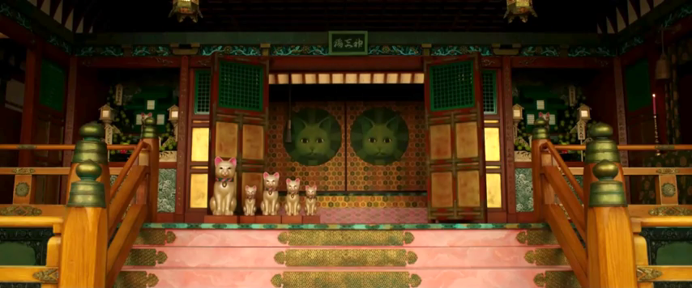

## 🧮 Median Filter Program

This program applies the **median filtering technique** across a set of images to produce a single, blended output image.  
Users can drop any **odd number of images** into the `images/filter_odd_imgs` folder, and the program will compute the **median pixel values** across all input images — effectively reducing noise and transient elements while preserving consistent features.

🧠 **About Median Filtering:**  
Median filtering is a common image processing method used to **remove noise or moving objects** across multiple frames.  
Rather than averaging pixels (which causes blur), it takes the **median value** of each pixel position across all images, ensuring that only persistent features remain — making it ideal for removing objects like people or cars that appear in different positions between shots.

---

## 🖼️ Demo

Below are some of the source frames used:

| | Input Frames  |  |
|:--:|:--:|:--:|
|  |  |  |
|  |  |  |

After processing with the **Median Filter Program**, the moving character is removed, leaving a clean composite background:

| **Resulting Image** |
|:--:|
|  |

Each image captures a slightly different moment in time — meaning the character appears in different positions across frames.
By comparing the median pixel values across all images, the algorithm effectively identifies and preserves only the consistent background pixels, while disregarding transient elements like the moving character.
The result is a seamless background reconstruction — achieving what looks like “magic” object removal, all without any complex machine learning or object detection techniques.

---

📁 **Usage:**  
1. Place an ODD number of input images you wish to apply apply a filter on inside `images/filter_odd_imgs/`.  
2. Run the program by executing `median_filter.py`. It will process the images, generate a new composite image, save it, and   automatically display the resulting median-filtered output
